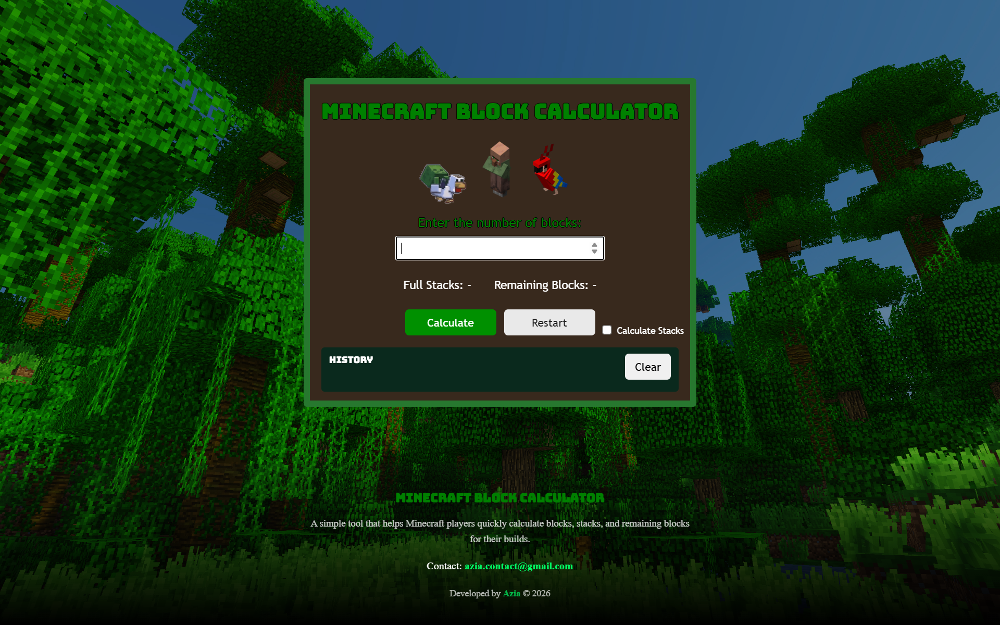
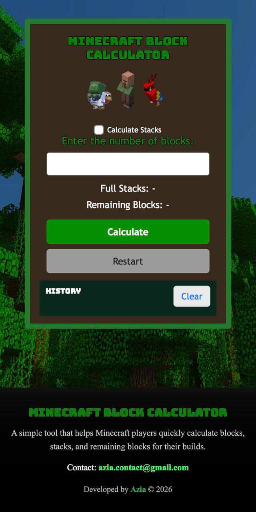

# 🧱 Minecraft Block Calculator

A simple and practical web tool that helps Minecraft players calculate the total number of blocks needed for their building projects.

---

## 🚀 Live Demo

🔗 https://azia-lab.github.io/minecraft-block-calculator/

---

## 📌 About The Project

Minecraft Block Calculator is a lightweight web application designed to make planning builds easier for Minecraft players.

Instead of manually calculating rows and layers, this tool provides instant and accurate block calculations based on user input.

The project focuses on simplicity, clean UI, performance, and responsive design.

---

## ✨ Features

- 🧮 Accurate block calculations
- 🌐 Multi-language support
- 📱 Fully responsive (Desktop & Mobile)
- 🎨 Clean and minimal interface
- ⚡ Fast and lightweight

---

## 🛠️ Built With

- HTML5  
- CSS3  
- JavaScript  

---

## 📷 Screenshots

### 💻 Desktop View

### 📱 Mobile View

---

## 🎯 Purpose

This project was built as a front-end practice project to improve skills in:

- DOM manipulation  
- UI structuring  
- Responsive layout design  
- Git & GitHub workflow  
- Deploying with GitHub Pages  

---

## 📄 License

This project is open-source and available for learning purposes.
