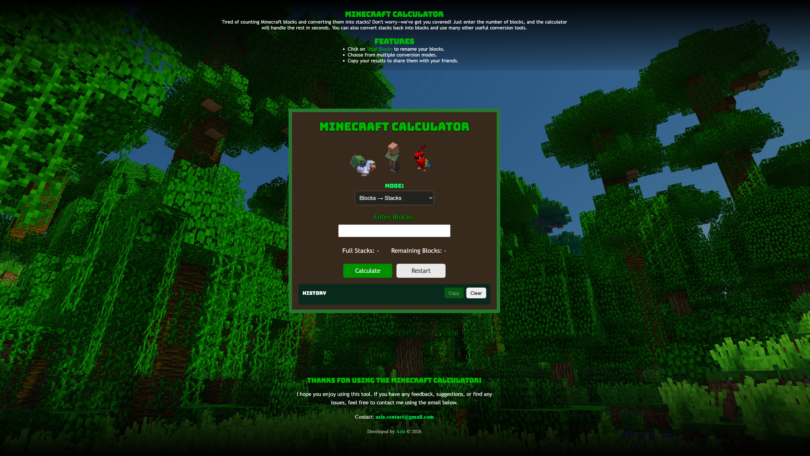
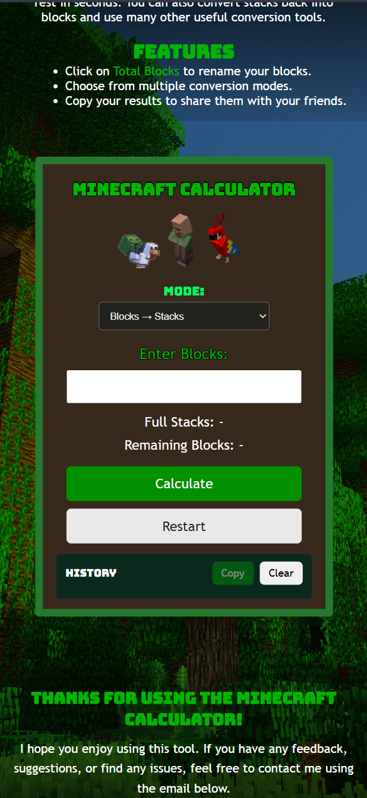

# 🧱 Minecraft Calculator

A fast, lightweight, and user-friendly web application that helps Minecraft players perform resource calculations quickly and accurately.

---

## 🚀 Live Demo

🔗 https://azia-lab.github.io/minecraft-block-calculator/

---

## 📌 About The Project

Minecraft Calculator is a web application designed to simplify resource planning for Minecraft players.

Whether you need to convert blocks into stacks, calculate the number of shulker boxes required, or estimate the contents of double chests, the calculator provides instant and accurate results.

The project focuses on performance, simplicity, responsive design, and an intuitive Minecraft-inspired user interface.

---

## ✨ Features

- 🧱 Blocks → Stacks
- 📦 Stacks → Blocks
- 🟪 Stacks → Shulker Boxes
- 📦 Shulker Boxes → Stacks
- 🗄️ Double Chests → Blocks
- 🗄️ Double Chests → Stacks
- 🌐 Multi-language support
- 📜 Calculation history
- 📋 One-click copy results
- 📱 Fully responsive (Desktop & Mobile)
- 🎨 Minecraft-inspired interface
- ⚡ Fast and lightweight

---

## 🛠️ Built With

- HTML5
- CSS3
- JavaScript

---

## 📷 Screenshots

### 💻 Desktop View

### 📱 Mobile View

---

## 🎯 Purpose

This project was created to improve front-end web development skills while building a practical tool for the Minecraft community.

The project provided hands-on experience with:

- DOM manipulation
- Responsive web design
- User interface development
- Git & GitHub workflow
- GitHub Pages deployment

---

## 📄 License

This project is open source and intended for educational and personal use.